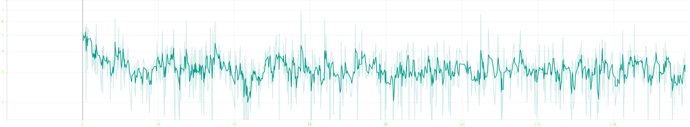
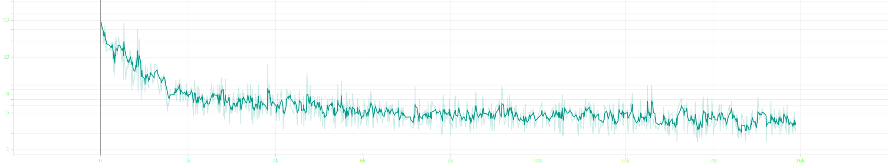
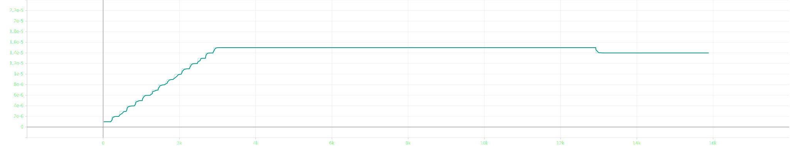
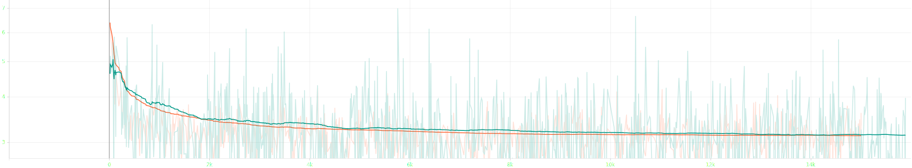

# attempt 10

- bug: avg grad_norm is inf
- current change: rollback llm to `vicunaa-13b-v1.1`~~, use llm in 8bit quantization~~, set batch_size `1`~~, set grad_acc `2`~~ and update ann ratio 99:0.5:0.5
- planned change: gradient clipping `10` &rarr; `5`, update lr-family fit to 4-gpu and use llm  in 8bit quantization

## experimental settings
- randomly split `salmonn_stage1_data.json` into train, validation and test set with 99:0.5:0.5 ratio
- use smaller speech model `whisper-large-v2` &rarr; `whisper-medium`
- use smaller llm `vicuna-13b-v1.1` &rarr; `vicuna-7b-v1.1`
- load llm in 8bit for low resource
- use torchrun for distributed learning
- reduced batch size `8` &rarr; `6` ~~and doubled gradient accumulation `1` &rarr; `2`~~, ~~not~~ keeping the ratio
- scaled `warmup_start_lr`, `init_lr` and `min_lr` by 0.75x ~~and scaled `init_lr` by 0.5x~~
- ~~scaled `warmup_steps` by 3x~~
- ~~applied gradient clipping `1`~~
- scaled gradient clipping `1` &rarr; `10`

## log

### train | 1st epoch | completed
```bash
Train: data epoch: [0]  [2999/3000]  eta: 0:00:00  lr: 0.000015  loss: 3.6475  grad_norm: 9.5527  time: 0.1573  data: 0.0000  max mem: 29333
Train: data epoch: [0] Total time: 0:08:05 (0.1620 s / it)
/home/jpong/miniconda3/envs/salmonn/lib/python3.9/site-packages/torch/distributed/distributed_c10d.py:4807: UserWarning: No device id is provided via `init_process_group` or `barrier `. Using the current device set by the user.
  warnings.warn(  # warn only once
/home/jpong/miniconda3/envs/salmonn/lib/python3.9/site-packages/torch/distributed/distributed_c10d.py:4807: UserWarning: No device id is provided via `init_process_group` or `barrier `. Using the current device set by the user.
  warnings.warn(  # warn only once
2025-09-21 23:37:10,416 [INFO] Averaged stats: lr: 0.0000  loss: 3.3791  grad_norm: inf
```

### eval | 1st epoch | completed
```bash
Eval: data epoch: [0]  [1685/1686]  eta: 0:00:00    time: 0.0770  data: 0.0001  max mem: 29333
Eval: data epoch: [0] Total time: 0:02:16 (0.0808 s / it)
2025-09-21 23:39:28,120 [INFO] Saving checkpoint at epoch 0 to /home/jpong/Workspace/jaeeewon/SALMONN_output/202509212327/checkpoint_best.pth.
2025-09-21 23:39:28,400 [INFO] Saving checkpoint at epoch 0 to /home/jpong/Workspace/jaeeewon/SALMONN_output/202509212327/checkpoint_0.pth.
```

### train | 2nd epoch | completed
```bash
Train: data epoch: [1]  [2999/3000]  eta: 0:00:00  lr: 0.000015  loss: 3.9958  grad_norm: 5.1574  time: 0.1623  data: 0.0000  max mem: 29350
Train: data epoch: [1] Total time: 0:08:07 (0.1626 s / it)
2025-09-21 23:47:36,329 [INFO] Averaged stats: lr: 0.0000  loss: 3.1551  grad_norm: 5.8868
```

### eval | 2nd epoch | completed
```bash
Eval: data epoch: [1]  [1685/1686]  eta: 0:00:00    time: 0.0790  data: 0.0001  max mem: 29350
Eval: data epoch: [1] Total time: 0:02:16 (0.0810 s / it)
2025-09-21 23:49:54,060 [INFO] Saving checkpoint at epoch 1 to /home/jpong/Workspace/jaeeewon/SALMONN_output/202509212327/checkpoint_best.pth.
2025-09-21 23:49:54,513 [INFO] Saving checkpoint at epoch 1 to /home/jpong/Workspace/jaeeewon/SALMONN_output/202509212327/checkpoint_1.pth.
```

### train | 3rd epoch | completed
```bash
Train: data epoch: [2]  [2999/3000]  eta: 0:00:00  lr: 0.000015  loss: 2.7378  grad_norm: 3.1699  time: 0.1660  data: 0.0000  max mem: 29350
Train: data epoch: [2] Total time: 0:08:04 (0.1616 s / it)
2025-09-21 23:57:59,565 [INFO] Averaged stats: lr: 0.0000  loss: 3.1247  grad_norm: inf
```

### eval | 3rd epoch | completed
```bash
Eval: data epoch: [2]  [1685/1686]  eta: 0:00:00    time: 0.0798  data: 0.0001  max mem: 29350
Eval: data epoch: [2] Total time: 0:02:16 (0.0812 s / it)
2025-09-22 00:00:17,497 [INFO] Saving checkpoint at epoch 2 to /home/jpong/Workspace/jaeeewon/SALMONN_output/202509212327/checkpoint_best.pth.
2025-09-22 00:00:17,925 [INFO] Saving checkpoint at epoch 2 to /home/jpong/Workspace/jaeeewon/SALMONN_output/202509212327/checkpoint_2.pth.
```

### train | 4th epoch | completed
```bash
Train: data epoch: [3]  [2999/3000]  eta: 0:00:00  lr: 0.000015  loss: 5.2824  grad_norm: 4.8719  time: 0.1605  data: 0.0000  max mem: 29350
Train: data epoch: [3] Total time: 0:08:05 (0.1620 s / it)
2025-09-22 00:08:24,040 [INFO] Averaged stats: lr: 0.0000  loss: 3.1236  grad_norm: 4.5786
```

### eval | 4th epoch | completed
```bash
Eval: data epoch: [3]  [1685/1686]  eta: 0:00:00    time: 0.0780  data: 0.0001  max mem: 29350
Eval: data epoch: [3] Total time: 0:02:16 (0.0810 s / it)
2025-09-22 00:10:41,593 [INFO] Saving checkpoint at epoch 3 to /home/jpong/Workspace/jaeeewon/SALMONN_output/202509212327/checkpoint_best.pth.
2025-09-22 00:10:42,043 [INFO] Saving checkpoint at epoch 3 to /home/jpong/Workspace/jaeeewon/SALMONN_output/202509212327/checkpoint_3.pth.
```

### train | 5th epoch | completed
```bash
Train: data epoch: [4]  [2999/3000]  eta: 0:00:00  lr: 0.000014  loss: 3.2578  grad_norm: 4.3067  time: 0.1572  data: 0.0000  max mem: 29350
Train: data epoch: [4] Total time: 0:08:07 (0.1626 s / it)
2025-09-22 00:18:50,102 [INFO] Averaged stats: lr: 0.0000  loss: 3.1185  grad_norm: inf
```

### eval | 5th epoch | completed
```bash
Eval: data epoch: [4]  [1685/1686]  eta: 0:00:00    time: 0.0780  data: 0.0001  max mem: 29350
Eval: data epoch: [4] Total time: 0:02:16 (0.0807 s / it)
2025-09-22 00:21:08,028 [INFO] Saving checkpoint at epoch 4 to /home/jpong/Workspace/jaeeewon/SALMONN_output/202509212327/checkpoint_best.pth.
2025-09-22 00:21:08,477 [INFO] Saving checkpoint at epoch 4 to /home/jpong/Workspace/jaeeewon/SALMONN_output/202509212327/checkpoint_4.pth.
```

## result


- loss until epoch 5


- grad norm until epoch 5


- lr until epoch 5


- loss comparison between attempt 5 and 10, which learnt for 5 epochs

### first epoch
#### train | 1st epoch | completed
```json
{"train_lr": "0.000", "train_loss": "3.379", "train_grad_norm": "inf"}
```
#### eval | 1st epoch | completed
```json
{"valid_loss": 3.1614487171173096, "valid_agg_metrics": 0.3923951983451843, "valid_best_epoch": 0}
```

### second epoch
#### train | 2nd epoch | completed
```json
{"train_lr": "0.000", "train_loss": "3.155", "train_grad_norm": "5.887"}
```
#### eval | 2nd epoch | completed
```json
{"valid_loss": 3.123823642730713, "valid_agg_metrics": 0.3970499336719513, "valid_best_epoch": 1}
```

### third epoch
#### train | 3rd epoch | completed
```json
{"train_lr": "0.000", "train_loss": "3.125", "train_grad_norm": "inf"}
```
#### eval | 3rd epoch | completed
```json
{"valid_loss": 3.108044147491455, "valid_agg_metrics": 0.39785701036453247, "valid_best_epoch": 2}
```

### fourth epoch
#### train | 4th epoch | completed
```json
{"train_lr": "0.000", "train_loss": "3.124", "train_grad_norm": "4.579"}
```
#### eval | 4th epoch | completed
```json
{"valid_loss": 3.1026647090911865, "valid_agg_metrics": 0.39803096652030945, "valid_best_epoch": 3}
```

### fifth epoch
#### train | 5th epoch | completed
```json
{"train_lr": "0.000", "train_loss": "3.119", "train_grad_norm": "inf"}
```
#### eval | 5th epoch | completed
```json
{"valid_loss": 3.0930960178375244, "valid_agg_metrics": 0.3995129466056824, "valid_best_epoch": 4}
```