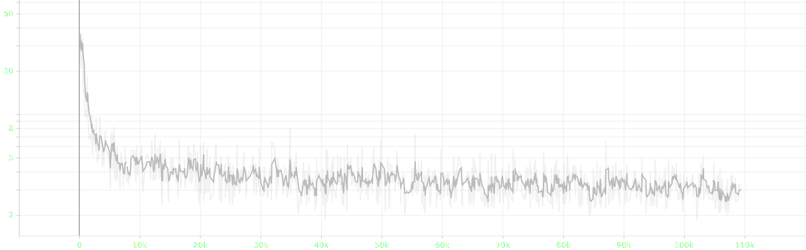

# attempt 11

- bug: avg grad_norm is inf
- current change: ~~use llm in 8bit quantization, epoch-based and~~ rollback to `whisper-large-v2` ~~and set accum_grads `2`~~
- planned change: gradient clipping `10` &rarr; `5`, update lr-family fit to 4-gpu

## experimental settings
- randomly split `salmonn_stage1_data.json` into train, validation and test set with 99:0.5:0.5 ratio
- ~~use smaller speech model `whisper-large-v2` &rarr; `whisper-medium`~~
- ~~use smaller llm `vicuna-13b-v1.1` &rarr; `vicuna-7b-v1.1`~~
- ~~load llm in 8bit for low resource~~
- use torchrun for distributed learning
- reduced batch size `8` &rarr; `1` ~~and doubled gradient accumulation `1` &rarr; `2`, not keeping the ratio~~
- ~~scaled `warmup_start_lr`, `init_lr` and `min_lr` by 0.75x and scaled `init_lr` by 0.5x~~
- ~~scaled `warmup_steps` by 3x~~
- ~~applied gradient clipping `1`~~
- scaled gradient clipping `1` &rarr; `10`

## log


## result


- loss until 1.37k/3k iters of epoch 37


- grad norm until 1.37k/3k iters of epoch 37


- lr until 1.37k/3k iters of epoch 37


```json
{"train_lr": "0.000", "train_loss": "3.382", "train_grad_norm": "inf"}
{"valid_loss": 3.1666252613067627, "valid_agg_metrics": 0.39250651001930237, "valid_best_epoch": 0}
{"train_lr": "0.000", "train_loss": "3.157", "train_grad_norm": "5.727"}
{"valid_loss": 3.126100778579712, "valid_agg_metrics": 0.3964445888996124, "valid_best_epoch": 1}
{"train_lr": "0.000", "train_loss": "3.125", "train_grad_norm": "inf"}
{"valid_loss": 3.1103498935699463, "valid_agg_metrics": 0.39685511589050293, "valid_best_epoch": 2}
{"train_lr": "0.000", "train_loss": "3.125", "train_grad_norm": "inf"}
{"valid_loss": 3.1032652854919434, "valid_agg_metrics": 0.3985736668109894, "valid_best_epoch": 3}
{"train_lr": "0.000", "train_loss": "3.118", "train_grad_norm": "inf"}
{"valid_loss": 3.0933499336242676, "valid_agg_metrics": 0.39973559975624084, "valid_best_epoch": 4}
{"train_lr": "0.000", "train_loss": "3.087", "train_grad_norm": "inf"}
{"valid_loss": 3.088157892227173, "valid_agg_metrics": 0.40063315629959106, "valid_best_epoch": 5}
{"train_lr": "0.000", "train_loss": "3.105", "train_grad_norm": "4.114"}
{"valid_loss": 3.081510543823242, "valid_agg_metrics": 0.4011549949645996, "valid_best_epoch": 6}
{"train_lr": "0.000", "train_loss": "3.085", "train_grad_norm": "inf"}
{"valid_loss": 3.0772545337677, "valid_agg_metrics": 0.40172553062438965, "valid_best_epoch": 7}
{"train_lr": "0.000", "train_loss": "3.094", "train_grad_norm": "inf"}
{"valid_loss": 3.073495864868164, "valid_agg_metrics": 0.40241432189941406, "valid_best_epoch": 8}
{"train_lr": "0.000", "train_loss": "3.092", "train_grad_norm": "3.836"}
{"valid_loss": 3.0723025798797607, "valid_agg_metrics": 0.4022751748561859, "valid_best_epoch": 8}
{"train_lr": "0.000", "train_loss": "3.082", "train_grad_norm": "inf"}
{"valid_loss": 3.0705459117889404, "valid_agg_metrics": 0.4025813043117523, "valid_best_epoch": 10}
{"train_lr": "0.000", "train_loss": "3.087", "train_grad_norm": "inf"}
{"valid_loss": 3.0662879943847656, "valid_agg_metrics": 0.4026091396808624, "valid_best_epoch": 11}
{"train_lr": "0.000", "train_loss": "3.081", "train_grad_norm": "inf"}
{"valid_loss": 3.066438674926758, "valid_agg_metrics": 0.40356236696243286, "valid_best_epoch": 12}
{"train_lr": "0.000", "train_loss": "3.080", "train_grad_norm": "3.623"}
{"valid_loss": 3.0610287189483643, "valid_agg_metrics": 0.4035206139087677, "valid_best_epoch": 12}
{"train_lr": "0.000", "train_loss": "3.093", "train_grad_norm": "inf"}
{"valid_loss": 3.062744379043579, "valid_agg_metrics": 0.4037780463695526, "valid_best_epoch": 14}
{"train_lr": "0.000", "train_loss": "3.074", "train_grad_norm": "inf"}
{"valid_loss": 3.057934045791626, "valid_agg_metrics": 0.4045851528644562, "valid_best_epoch": 15}
{"train_lr": "0.000", "train_loss": "3.085", "train_grad_norm": "inf"}
{"valid_loss": 3.057469367980957, "valid_agg_metrics": 0.40393808484077454, "valid_best_epoch": 15}
{"train_lr": "0.000", "train_loss": "3.079", "train_grad_norm": "inf"}
{"valid_loss": 3.056323289871216, "valid_agg_metrics": 0.4040076434612274, "valid_best_epoch": 15}
{"train_lr": "0.000", "train_loss": "3.077", "train_grad_norm": "inf"}
{"valid_loss": 3.053581476211548, "valid_agg_metrics": 0.4045851528644562, "valid_best_epoch": 15}
{"train_lr": "0.000", "train_loss": "3.076", "train_grad_norm": "inf"}
{"valid_loss": 3.051255941390991, "valid_agg_metrics": 0.4041259288787842, "valid_best_epoch": 15}
{"train_lr": "0.000", "train_loss": "3.068", "train_grad_norm": "inf"}
{"valid_loss": 3.050389051437378, "valid_agg_metrics": 0.40465471148490906, "valid_best_epoch": 20}
{"train_lr": "0.000", "train_loss": "3.066", "train_grad_norm": "inf"}
{"valid_loss": 3.050337314605713, "valid_agg_metrics": 0.40508610010147095, "valid_best_epoch": 21}
{"train_lr": "0.000", "train_loss": "3.066", "train_grad_norm": "inf"}
{"valid_loss": 3.0485918521881104, "valid_agg_metrics": 0.4054618179798126, "valid_best_epoch": 22}
{"train_lr": "0.000", "train_loss": "3.080", "train_grad_norm": "inf"}
{"valid_loss": 3.0501110553741455, "valid_agg_metrics": 0.4048634469509125, "valid_best_epoch": 22}
{"train_lr": "0.000", "train_loss": "3.071", "train_grad_norm": "inf"}
{"valid_loss": 3.048006772994995, "valid_agg_metrics": 0.4057053327560425, "valid_best_epoch": 24}
{"train_lr": "0.000", "train_loss": "3.067", "train_grad_norm": "3.349"}
{"valid_loss": 3.045537233352661, "valid_agg_metrics": 0.40551748871803284, "valid_best_epoch": 24}
{"train_lr": "0.000", "train_loss": "3.069", "train_grad_norm": "inf"}
{"valid_loss": 3.0465176105499268, "valid_agg_metrics": 0.40455731749534607, "valid_best_epoch": 24}
{"train_lr": "0.000", "train_loss": "3.061", "train_grad_norm": "3.321"}
{"valid_loss": 3.0452916622161865, "valid_agg_metrics": 0.4059140682220459, "valid_best_epoch": 27}
{"train_lr": "0.000", "train_loss": "3.059", "train_grad_norm": "inf"}
{"valid_loss": 3.0437769889831543, "valid_agg_metrics": 0.4059975743293762, "valid_best_epoch": 28}
{"train_lr": "0.000", "train_loss": "3.047", "train_grad_norm": "inf"}
{"valid_loss": 3.0430614948272705, "valid_agg_metrics": 0.40610888600349426, "valid_best_epoch": 29}
{"train_lr": "0.000", "train_loss": "3.058", "train_grad_norm": "3.268"}
{"valid_loss": 3.0435218811035156, "valid_agg_metrics": 0.40539222955703735, "valid_best_epoch": 29}
{"train_lr": "0.000", "train_loss": "3.074", "train_grad_norm": "inf"}
{"valid_loss": 3.041138172149658, "valid_agg_metrics": 0.4059210419654846, "valid_best_epoch": 29}
{"train_lr": "0.000", "train_loss": "3.070", "train_grad_norm": "inf"}
{"valid_loss": 3.0417888164520264, "valid_agg_metrics": 0.4062480330467224, "valid_best_epoch": 32}
{"train_lr": "0.000", "train_loss": "3.062", "train_grad_norm": "inf"}
{"valid_loss": 3.039224624633789, "valid_agg_metrics": 0.4061436653137207, "valid_best_epoch": 32}
{"train_lr": "0.000", "train_loss": "3.034", "train_grad_norm": "inf"}
{"valid_loss": 3.038658857345581, "valid_agg_metrics": 0.4065750539302826, "valid_best_epoch": 34}
{"train_lr": "0.000", "train_loss": "3.054", "train_grad_norm": "inf"}
{"valid_loss": 3.038254976272583, "valid_agg_metrics": 0.4060184359550476, "valid_best_epoch": 34}
```