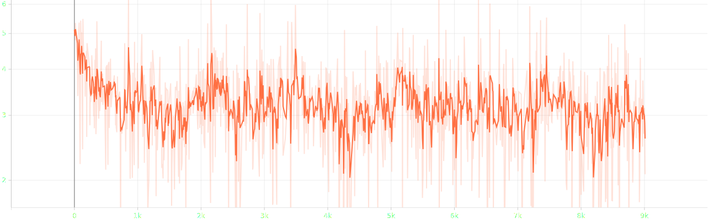
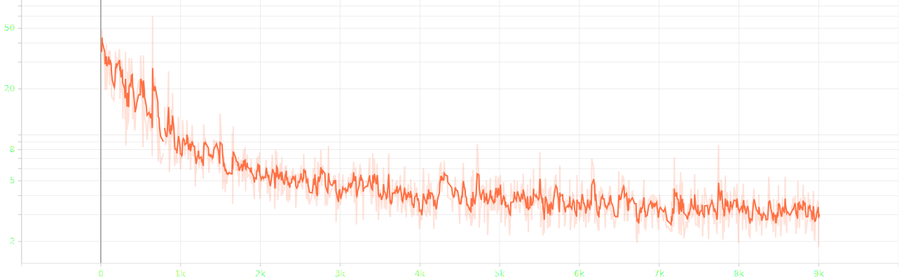
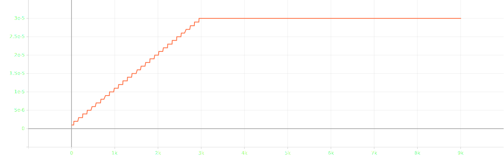

# attempt 12

- bug: avg grad_norm is inf
- current change: rollback lr-family
- planned change: gradient clipping `10` &rarr; `5`, update lr-family fit to 4-gpu

## experimental settings
- randomly split `salmonn_stage1_data.json` into train, validation and test set with 99:0.5:0.5 ratio
- ~~use smaller speech model `whisper-large-v2` &rarr; `whisper-medium`~~
- ~~use smaller llm `vicuna-13b-v1.1` &rarr; `vicuna-7b-v1.1`~~
- ~~load llm in 8bit for low resource~~
- use torchrun for distributed learning
- reduced batch size `8` &rarr; `1` ~~and doubled gradient accumulation `1` &rarr; `2`, not keeping the ratio~~
- ~~scaled `warmup_start_lr`, `init_lr` and `min_lr` by 0.75x and scaled `init_lr` by 0.5x~~
- ~~scaled `warmup_steps` by 3x~~
- ~~applied gradient clipping `1`~~
- scaled gradient clipping `1` &rarr; `10`

## log

### first epoch
#### train
```bash
Train: data epoch: [0]  [2999/3000]  eta: 0:00:00  lr: 0.000030  loss: 3.4940  grad_norm: 5.8133  time: 0.1741  data: 0.0000  max mem: 30655
Train: data epoch: [0] Total time: 0:08:51 (0.1773 s / it)
/home/jpong/miniconda3/envs/salmonn/lib/python3.9/site-packages/torch/distributed/distributed_c10d.py:4807: UserWarning: No device id is provided via `init_process_group` or `barrier `. Using the current device set by the user.
  warnings.warn(  # warn only once
2025-09-22 10:23:07,191 [INFO] Averaged stats: lr: 0.0000  loss: 3.3069  grad_norm: inf
```
#### eval
```bash
Eval: data epoch: [0]  [1685/1686]  eta: 0:00:00    time: 0.0968  data: 0.0001  max mem: 30655
Eval: data epoch: [0] Total time: 0:02:46 (0.0986 s / it)
2025-09-22 10:25:54,657 [INFO] Saving checkpoint at epoch 0 to /home/jpong/Workspace/jaeeewon/SALMONN_output/202509221012/checkpoint_best.pth.
2025-09-22 10:25:54,940 [INFO] Saving checkpoint at epoch 0 to /home/jpong/Workspace/jaeeewon/SALMONN_output/202509221012/checkpoint_0.pth.
```

### second epoch
#### train
```bash
Train: data epoch: [1]  [2999/3000]  eta: 0:00:00  lr: 0.000030  loss: 3.9676  grad_norm: 3.5766  time: 0.1789  data: 0.0000  max mem: 30697
Train: data epoch: [1] Total time: 0:08:52 (0.1776 s / it)
2025-09-22 10:34:47,880 [INFO] Averaged stats: lr: 0.0000  loss: 3.1452  grad_norm: 4.0473
```
#### eval
```bash
Eval: data epoch: [1]  [1685/1686]  eta: 0:00:00    time: 0.0966  data: 0.0001  max mem: 30697
Eval: data epoch: [1] Total time: 0:02:45 (0.0984 s / it)
2025-09-22 10:37:35,871 [INFO] Saving checkpoint at epoch 1 to /home/jpong/Workspace/jaeeewon/SALMONN_output/202509221012/checkpoint_best.pth.
2025-09-22 10:37:36,282 [INFO] Saving checkpoint at epoch 1 to /home/jpong/Workspace/jaeeewon/SALMONN_output/202509221012/checkpoint_1.pth.
```

### third epoch
#### train
```bash
Train: data epoch: [2]  [2999/3000]  eta: 0:00:00  lr: 0.000030  loss: 2.7251  grad_norm: 1.8353  time: 0.1762  data: 0.0000  max mem: 30697
Train: data epoch: [2] Total time: 0:08:52 (0.1776 s / it)
2025-09-22 10:46:29,355 [INFO] Averaged stats: lr: 0.0000  loss: 3.1173  grad_norm: inf
```
#### eval
```bash
Eval: data epoch: [2]  [1685/1686]  eta: 0:00:00    time: 0.0954  data: 0.0001  max mem: 30697
Eval: data epoch: [2] Total time: 0:02:45 (0.0984 s / it)
2025-09-22 10:49:17,282 [INFO] Saving checkpoint at epoch 2 to /home/jpong/Workspace/jaeeewon/SALMONN_output/202509221012/checkpoint_best.pth.
2025-09-22 10:49:17,732 [INFO] Saving checkpoint at epoch 2 to /home/jpong/Workspace/jaeeewon/SALMONN_output/202509221012/checkpoint_2.pth.
```

## result


- loss until epoch 3


- grad norm until epoch 3


- lr until epoch 3

### first epoch
#### train
```json
{"train_lr": "0.000", "train_loss": "3.307", "train_grad_norm": "inf"}
```
#### eval
```json
{"valid_loss": 3.152193069458008, "valid_agg_metrics": 0.39407896995544434, "valid_best_epoch": 0}
```

### second epoch
#### train
```json
{"train_lr": "0.000", "train_loss": "3.145", "train_grad_norm": "4.047"}
```
#### eval
```json
{"valid_loss": 3.1162679195404053, "valid_agg_metrics": 0.3979613780975342, "valid_best_epoch": 1}
```

### third epoch
#### train
```json
{"train_lr": "0.000", "train_loss": "3.117", "train_grad_norm": "inf"}
```
#### eval
```json
{"valid_loss": 3.1029436588287354, "valid_agg_metrics": 0.39823970198631287, "valid_best_epoch": 2}
```