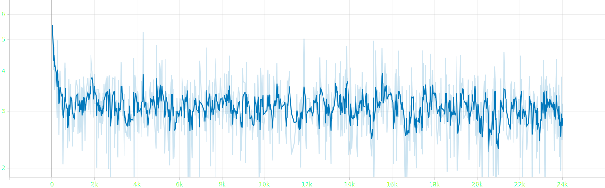
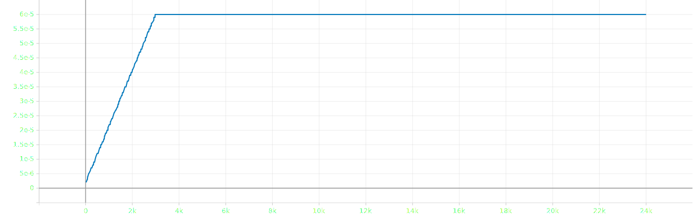

# attempt 13

- bug: avg grad_norm is inf
- current change: batch_size `2`, double lr-family, quantization and disable gradient clipping
- planned change: gradient clipping `10` &rarr; `5`, update lr-family fit to 4-gpu

## experimental settings
- randomly split `salmonn_stage1_data.json` into train, validation and test set with 99:0.5:0.5 ratio
- ~~use smaller speech model `whisper-large-v2` &rarr; `whisper-medium`~~
- ~~use smaller llm `vicuna-13b-v1.1` &rarr; `vicuna-7b-v1.1`~~
- load llm in 8bit for low resource
- use torchrun for distributed learning
- **reduced batch size `8` &rarr; `4`** and ~~doubled gradient accumulation `1` &rarr; `4`, not keeping the ratio~~
- ~~scaled `warmup_start_lr`, `init_lr` and `min_lr` by 0.75x and scaled `init_lr` by 0.5x~~
- ~~scaled `warmup_steps` by 3x~~
- ~~applied gradient clipping `1`~~
- ~~scaled gradient clipping `1` &rarr; `10`~~

## log
### 8th epoch
#### train
```bash
Train: data epoch: [7]  [2999/3000]  eta: 0:00:00  lr: 0.000060  loss: 3.1673  time: 0.3823  data: 0.0000  max mem: 23224
Train: data epoch: [7] Total time: 0:19:04 (0.3816 s / it)
2025-09-22 16:06:55,548 [INFO] Averaged stats: lr: 0.0001  loss: 3.0582
```

## result


- loss until epoch 8


- lr until epoch 8

### first epoch
#### train
```json
{"train_lr": "0.000", "train_loss": "3.236"}
```
#### eval
```json
{"valid_loss": 3.0799570083618164, "valid_agg_metrics": 0.3971194922924042, "valid_best_epoch": 0}
```

### second epoch
#### train
```json
{"train_lr": "0.000", "train_loss": "3.101"}
```
#### eval
```json
{"valid_loss": 3.0559921264648438, "valid_agg_metrics": 0.4003826677799225, "valid_best_epoch": 1}
```

### third epoch
#### train
```json
{"train_lr": "0.000", "train_loss": "3.084"}
```
#### eval
```json
{"valid_loss": 3.0397369861602783, "valid_agg_metrics": 0.4019899070262909, "valid_best_epoch": 2}
```

### fourth epoch
#### train
```json
{"train_lr": "0.000", "train_loss": "3.070"}
```
#### eval
```json
{"valid_loss": 3.0308120250701904, "valid_agg_metrics": 0.4030057489871979, "valid_best_epoch": 3}
```

### fifth epoch
#### train
```json
{"train_lr": "0.000", "train_loss": "3.073"}
```
#### eval
```json
{"valid_loss": 3.0213565826416016, "valid_agg_metrics": 0.40386155247688293, "valid_best_epoch": 4}
```

### sixth epoch
#### train
```json
{"train_lr": "0.000", "train_loss": "3.062"}
```
#### eval
```json
{"valid_loss": 3.0183966159820557, "valid_agg_metrics": 0.40452948212623596, "valid_best_epoch": 5}
```

### seventh epoch
#### train
```json
{"train_lr": "0.000", "train_loss": "3.057"}
```
#### eval
```json
{"valid_loss": 3.0101847648620605, "valid_agg_metrics": 0.4060880243778229, "valid_best_epoch": 6}
```

### eighth epoch
#### train
```json
{"train_lr": "0.000", "train_loss": "3.058"}
```