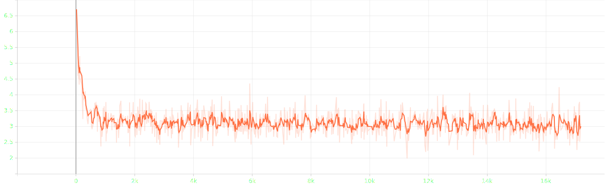
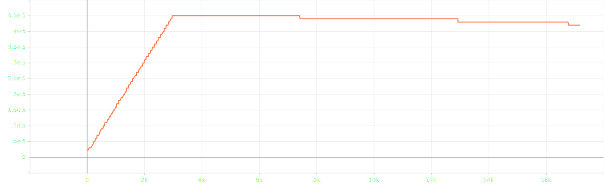
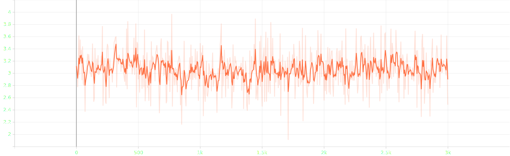
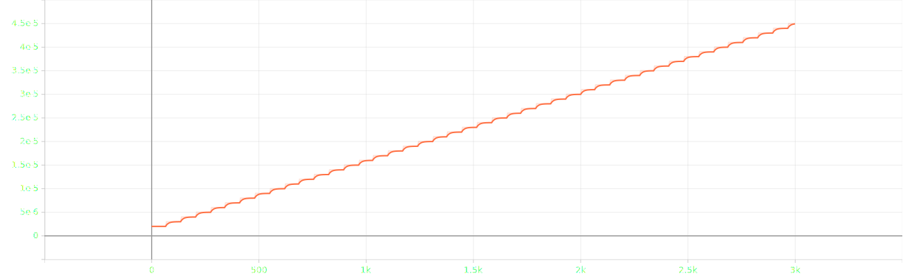

# attempt 3

## experimental settings
- randomly split `salmonn_stage1_data.json` into train, validation and test set with 90:5:5 ratio
- use smaller speech model `whisper-large-v2` &rarr; `whisper-medium`
- use smaller llm `vicuna-13b-v1.1` &rarr; `vicuna-7b-v1.1`
- ~~load llm in 8bit for low resource~~
- use torchrun for distributed learning
- **reduced batch size `8` &rarr; `6` and doubled gradient accumulation `1` &rarr; `2`, not keeping the ratio**
- scaled `warmup_start_lr`, `init_lr` and `min_lr` by 1.5x

## log

### abortion log
```log
Train: data epoch: [5]  [2375/3000]  eta: 0:03:45  lr: 0.000042  loss: 2.8917  time: 0.3609  data: 0.0000  max mem: 26051
[rank1]: Traceback (most recent call last):
[rank1]:   File "/home/jpong/Workspace/jaeeewon/repr_salmonn/salmonn/train.py", line 91, in <module>
[rank1]:     main()
[rank1]:   File "/home/jpong/Workspace/jaeeewon/repr_salmonn/salmonn/train.py", line 87, in main
[rank1]:     runner.train()
[rank1]:   File "/home/jpong/Workspace/jaeeewon/repr_salmonn/salmonn/runner.py", line 276, in train
[rank1]:     train_stats = self.train_epoch(cur_epoch)
[rank1]:   File "/home/jpong/Workspace/jaeeewon/repr_salmonn/salmonn/runner.py", line 116, in train_epoch
[rank1]:     samples = next(self.train_loader)
[rank1]:   File "/home/jpong/Workspace/jaeeewon/repr_salmonn/salmonn/utils.py", line 121, in __next__
[rank1]:     data = next(self.iter_loader)
[rank1]:   File "/home/jpong/miniconda3/envs/salmonn/lib/python3.9/site-packages/torch/utils/data/dataloader.py", line 734, in __next__
[rank1]:     data = self._next_data()
[rank1]:   File "/home/jpong/miniconda3/envs/salmonn/lib/python3.9/site-packages/torch/utils/data/dataloader.py", line 1516, in _next_data
[rank1]:     return self._process_data(data, worker_id)
[rank1]:   File "/home/jpong/miniconda3/envs/salmonn/lib/python3.9/site-packages/torch/utils/data/dataloader.py", line 1551, in _process_data
[rank1]:     data.reraise()
[rank1]:   File "/home/jpong/miniconda3/envs/salmonn/lib/python3.9/site-packages/torch/_utils.py", line 769, in reraise
[rank1]:     raise exception
[rank1]: soundfile.LibsndfileError: <exception str() failed>
W0921 05:29:27.905673 593970 site-packages/torch/distributed/elastic/multiprocessing/api.py:900] Sending process 594027 closing signal SIGTERM
W0921 05:29:27.906340 593970 site-packages/torch/distributed/elastic/multiprocessing/api.py:900] Sending process 594029 closing signal SIGTERM
W0921 05:29:27.907168 593970 site-packages/torch/distributed/elastic/multiprocessing/api.py:900] Sending process 594030 closing signal SIGTERM
E0921 05:29:27.909596 593970 site-packages/torch/distributed/elastic/multiprocessing/api.py:874] failed (exitcode: 1) local_rank: 1 (pid: 594028) of binary: /home/jpong/miniconda3/envs/salmonn/bin/python3.9
Traceback (most recent call last):
  File "/home/jpong/miniconda3/envs/salmonn/bin/torchrun", line 7, in <module>
    sys.exit(main())
  File "/home/jpong/miniconda3/envs/salmonn/lib/python3.9/site-packages/torch/distributed/elastic/multiprocessing/errors/__init__.py", line 357, in wrapper
    return f(*args, **kwargs)
  File "/home/jpong/miniconda3/envs/salmonn/lib/python3.9/site-packages/torch/distributed/run.py", line 901, in main
    run(args)
  File "/home/jpong/miniconda3/envs/salmonn/lib/python3.9/site-packages/torch/distributed/run.py", line 892, in run
    elastic_launch(
  File "/home/jpong/miniconda3/envs/salmonn/lib/python3.9/site-packages/torch/distributed/launcher/api.py", line 143, in __call__
    return launch_agent(self._config, self._entrypoint, list(args))
  File "/home/jpong/miniconda3/envs/salmonn/lib/python3.9/site-packages/torch/distributed/launcher/api.py", line 277, in launch_agent
    raise ChildFailedError(
torch.distributed.elastic.multiprocessing.errors.ChildFailedError:
============================================================
train.py FAILED
------------------------------------------------------------
Failures:
  <NO_OTHER_FAILURES>
------------------------------------------------------------
Root Cause (first observed failure):
[0]:
  time      : 2025-09-21_05:29:27
  host      : hufs_5090_4ea
  rank      : 1 (local_rank: 1)
  exitcode  : 1 (pid: 594028)
  error_file: <N/A>
  traceback : To enable traceback see: https://pytorch.org/docs/stable/elastic/errors.html
============================================================
```

### train | 6th epoch | completed
```log
Train: data epoch: [0]  [2999/3000]  eta: 0:00:00  lr: 0.000045  loss: 2.4855  time: 0.3629  data: 0.0000  max mem: 25096
Train: data epoch: [0] Total time: 0:18:03 (0.3613 s / it)
/home/jpong/miniconda3/envs/salmonn/lib/python3.9/site-packages/torch/distributed/distributed_c10d.py:4807: UserWarning: No device id is provided via `init_process_group` or `barrier `. Using the current device set by the user.
  warnings.warn(  # warn only once
2025-09-21 09:15:30,326 [INFO] Averaged stats: lr: 0.0000  loss: 3.074
```
### eval | 6th epoch | completed
```log
Eval: data epoch: [0]  [2846/2847]  eta: 0:00:00    time: 0.2215  data: 0.0002  max mem: 25096
Eval: data epoch: [0] Total time: 0:10:52 (0.2290 s / it)
2025-09-21 09:26:25,921 [INFO] Saving checkpoint at epoch 0 to /home/jpong/Workspace/jaeeewon/SALMONN_output/202509210856/checkpoint_best.pth.
2025-09-21 09:26:26,211 [INFO] Saving checkpoint at epoch 0 to /home/jpong/Workspace/jaeeewon/SALMONN_output/202509210856/checkpoint_0.pth.
```

## result


- loss until epoch 5


- lr until epoch 5

### resumed


- loss during epoch 6


- lr during epoch 6

### first epoch
#### train | 1st epoch | completed
```json
{"train_lr": "0.000", "train_loss": "3.345"}
```
#### eval | 1st epoch | completed
```json
{"valid_loss": 3.080728054046631, "valid_agg_metrics": 0.39230334758758545, "valid_best_epoch": 0}
```

### second epoch
#### train | 2nd epoch | compleeted
```json
{"train_lr": "0.000", "train_loss": "3.114"}
```
#### eval | 2nd epoch | completed
```json
{"valid_loss": 3.0528461933135986, "valid_agg_metrics": 0.39607182145118713, "valid_best_epoch": 1}
```

### third epoch
#### train | 3rd | completed
```json
{"train_lr": "0.000", "train_loss": "3.097"}
```
#### eval | 3rd | completed
```json
{"valid_loss": 3.0404140949249268, "valid_agg_metrics": 0.3974018394947052, "valid_best_epoch": 2}
```

### fourth epoch
#### train | 4th | completed
```json
{"train_lr": "0.000", "train_loss": "3.091"}
```
#### eval | 4th | completed
```json
{"valid_loss": 3.0267770290374756, "valid_agg_metrics": 0.3987704813480377, "valid_best_epoch": 3}
```

### fifth epoch
#### train | 5th | completed
```json
{"train_lr": "0.000", "train_loss": "3.082"}
```
#### eval | 5th | completed
```json
{"valid_loss": 3.0204429626464844, "valid_agg_metrics": 0.39962702989578247, "valid_best_epoch": 4}
```

### sixth epoch - resumed
#### train | 6th | completed
```json
{"train_lr": "0.000", "train_loss": "3.075"}
```
#### eval | 6th | completed
```json
{"valid_loss": 3.0166752338409424, "valid_agg_metrics": 0.39996036887168884, "valid_best_epoch": 0}
```