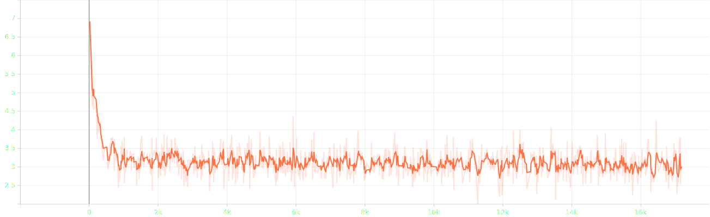
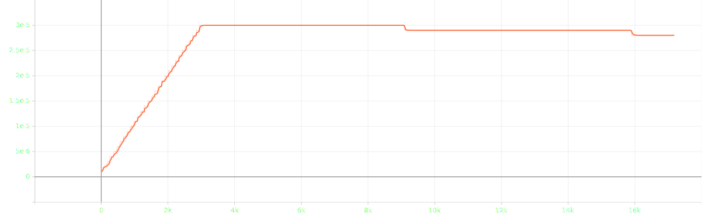

# attempt 4

## experimental settings
- randomly split `salmonn_stage1_data.json` into train, validation and test set with 90:5:5 ratio
- use smaller speech model `whisper-large-v2` &rarr; `whisper-medium`
- use smaller llm `vicuna-13b-v1.1` &rarr; `vicuna-7b-v1.1`
- ~~load llm in 8bit for low resource~~
- use torchrun for distributed learning
- reduced batch size `8` &rarr; `6` and doubled gradient accumulation `1` &rarr; `2`, not keeping the ratio
- ~~scaled `warmup_start_lr`, `init_lr` and `min_lr` by 1.5x~~

## log

### train | 1st epoch | completed
```bash
Train: data epoch: [0]  [2999/3000]  eta: 0:00:00  lr: 0.000030  loss: 2.5391  time: 0.3619  data: 0.0000  max mem: 25096
Train: data epoch: [0] Total time: 0:18:03 (0.3612 s / it)
/home/jpong/miniconda3/envs/salmonn/lib/python3.9/site-packages/torch/distributed/distributed_c10d.py:4807: UserWarning: No device id is provided via `init_process_group` or `barrier `. Using the current device set by the user.
  warnings.warn(  # warn only once
2025-09-21 09:55:27,192 [INFO] Averaged stats: lr: 0.0000  loss: 3.3965
```

### eval | 4th epoch | completed
```bash
Eval: data epoch: [3]  [2846/2847]  eta: 0:00:00    time: 0.2204  data: 0.0001  max mem: 26051
Eval: data epoch: [3] Total time: 0:10:51 (0.2287 s / it)
2025-09-21 11:33:16,502 [INFO] Saving checkpoint at epoch 3 to /home/jpong/Workspace/jaeeewon/SALMONN_output/202509210936/checkpoint_best.pth.
2025-09-21 11:33:16,892 [INFO] Saving checkpoint at epoch 3 to /home/jpong/Workspace/jaeeewon/SALMONN_output/202509210936/checkpoint_3.pth
```

### train | 5th epoch | completed
```bash
Train: data epoch: [4]  [2999/3000]  eta: 0:00:00  lr: 0.000029  loss: 3.3206  time: 0.3611  data: 0.0000  max mem: 26051
Train: data epoch: [4] Total time: 0:18:00 (0.3603 s / it)
2025-09-21 11:51:18,051 [INFO] Averaged stats: lr: 0.0000  loss: 3.088
```

### eval | 5th epoch | completed
```bash
Eval: data epoch: [4]  [2846/2847]  eta: 0:00:00    time: 0.2202  data: 0.0002  max mem: 26051
Eval: data epoch: [4] Total time: 0:10:50 (0.2287 s / it)
2025-09-21 12:02:13,055 [INFO] Saving checkpoint at epoch 4 to /home/jpong/Workspace/jaeeewon/SALMONN_output/202509210936/checkpoint_best.pth.
2025-09-21 12:02:13,454 [INFO] Saving checkpoint at epoch 4 to /home/jpong/Workspace/jaeeewon/SALMONN_output/202509210936/checkpoint_4.pth.
```

### abortion log
```bash
Train: data epoch: [5]  [2375/3000]  eta: 0:03:45  lr: 0.000028  loss: 2.8869  time: 0.3613  data: 0.0000  max mem: 26051
[rank1]: Traceback (most recent call last):
[rank1]:   File "/home/jpong/Workspace/jaeeewon/repr_salmonn/salmonn/train.py", line 91, in <module>
[rank1]:     main()
[rank1]:   File "/home/jpong/Workspace/jaeeewon/repr_salmonn/salmonn/train.py", line 87, in main
[rank1]:     runner.train()
[rank1]:   File "/home/jpong/Workspace/jaeeewon/repr_salmonn/salmonn/runner.py", line 276, in train
[rank1]:     train_stats = self.train_epoch(cur_epoch)
[rank1]:   File "/home/jpong/Workspace/jaeeewon/repr_salmonn/salmonn/runner.py", line 116, in train_epoch
[rank1]:     samples = next(self.train_loader)
[rank1]:   File "/home/jpong/Workspace/jaeeewon/repr_salmonn/salmonn/utils.py", line 121, in __next__
[rank1]:     data = next(self.iter_loader)
[rank1]:   File "/home/jpong/miniconda3/envs/salmonn/lib/python3.9/site-packages/torch/utils/data/dataloader.py", line 734, in __next__
[rank1]:     data = self._next_data()
[rank1]:   File "/home/jpong/miniconda3/envs/salmonn/lib/python3.9/site-packages/torch/utils/data/dataloader.py", line 1516, in _next_data
[rank1]:     return self._process_data(data, worker_id)
[rank1]:   File "/home/jpong/miniconda3/envs/salmonn/lib/python3.9/site-packages/torch/utils/data/dataloader.py", line 1551, in _process_data
[rank1]:     data.reraise()
[rank1]:   File "/home/jpong/miniconda3/envs/salmonn/lib/python3.9/site-packages/torch/_utils.py", line 769, in reraise
[rank1]:     raise exception
[rank1]: soundfile.LibsndfileError: <exception str() failed>
W0921 12:16:33.285456 628578 site-packages/torch/distributed/elastic/multiprocessing/api.py:900] Sending process 628645 closing signal SIGTERM
W0921 12:16:33.286039 628578 site-packages/torch/distributed/elastic/multiprocessing/api.py:900] Sending process 628647 closing signal SIGTERM
W0921 12:16:33.287325 628578 site-packages/torch/distributed/elastic/multiprocessing/api.py:900] Sending process 628648 closing signal SIGTERM
E0921 12:16:33.289154 628578 site-packages/torch/distributed/elastic/multiprocessing/api.py:874] failed (exitcode: 1) local_rank: 1 (pid: 628646) of binary: /home/jpong/miniconda3/envs/salmonn/bin/python3.9
Traceback (most recent call last):
  File "/home/jpong/miniconda3/envs/salmonn/bin/torchrun", line 7, in <module>
    sys.exit(main())
  File "/home/jpong/miniconda3/envs/salmonn/lib/python3.9/site-packages/torch/distributed/elastic/multiprocessing/errors/__init__.py", line 357, in wrapper
    return f(*args, **kwargs)
  File "/home/jpong/miniconda3/envs/salmonn/lib/python3.9/site-packages/torch/distributed/run.py", line 901, in main
    run(args)
  File "/home/jpong/miniconda3/envs/salmonn/lib/python3.9/site-packages/torch/distributed/run.py", line 892, in run
    elastic_launch(
  File "/home/jpong/miniconda3/envs/salmonn/lib/python3.9/site-packages/torch/distributed/launcher/api.py", line 143, in __call__
    return launch_agent(self._config, self._entrypoint, list(args))
  File "/home/jpong/miniconda3/envs/salmonn/lib/python3.9/site-packages/torch/distributed/launcher/api.py", line 277, in launch_agent
    raise ChildFailedError(
torch.distributed.elastic.multiprocessing.errors.ChildFailedError:
============================================================
train.py FAILED
------------------------------------------------------------
Failures:
  <NO_OTHER_FAILURES>
------------------------------------------------------------
Root Cause (first observed failure):
[0]:
  time      : 2025-09-21_12:16:33
  host      : hufs_5090_4ea
  rank      : 1 (local_rank: 1)
  exitcode  : 1 (pid: 628646)
  error_file: <N/A>
  traceback : To enable traceback see: https://pytorch.org/docs/stable/elastic/errors.html
============================================================
```

## result


- loss until 2.38k/3k iters of epoch 6


- lr until 2.38k/3k iters of epoch 6

### first epoch
#### train | 1st | completed
```json
{"train_lr": "0.000", "train_loss": "3.396"}
```
#### eval | 1st | completed
```json
{"valid_loss": 3.086390256881714, "valid_agg_metrics": 0.39174431562423706, "valid_best_epoch": 0}
```

### second epoch
#### train | 2nd | completed
```json
{"train_lr": "0.000", "train_loss": "3.120"}
```
#### eval | 2nd | completed
```json
{"valid_loss": 3.059879779815674, "valid_agg_metrics": 0.3951007127761841, "valid_best_epoch": 1}
```

### third epoch
#### train | 3rd | completed
```json
{"train_lr": "0.000", "train_loss": "3.103"}
```
#### eval | 3rd | completed
```json
{"valid_loss": 3.0465962886810303, "valid_agg_metrics": 0.3966571092605591, "valid_best_epoch": 2}
```

### fourth epoch
#### train | 4th | completed
```json
{"train_lr": "0.000", "train_loss": "3.097"}
```
#### eval | 4th | completed
```json
{"valid_loss": 3.033357858657837, "valid_agg_metrics": 0.3978656530380249, "valid_best_epoch": 3}
```

### fifth epoch
#### train | 5th | completed
```json
{"train_lr": "0.000", "train_loss": "3.088"}
```
#### eval | 5th | completed
```json
{"valid_loss": 3.026547431945801, "valid_agg_metrics": 0.39875322580337524, "valid_best_epoch": 4}
```