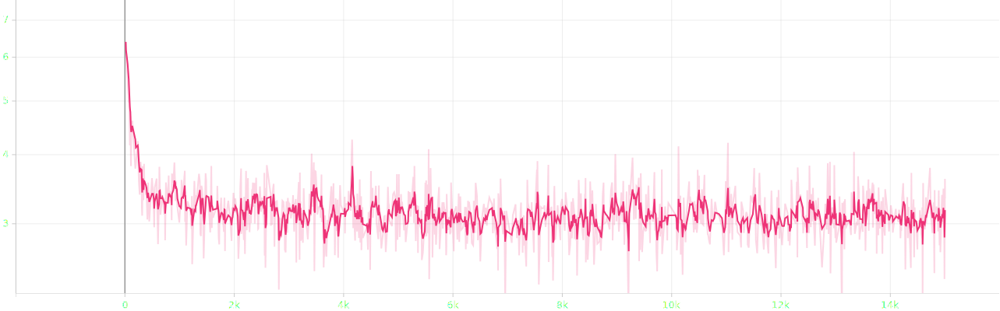
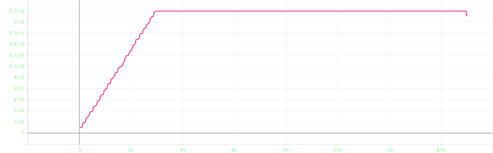

# attempt 5

## experimental settings
- randomly split `salmonn_stage1_data.json` into train, validation and test set with 90:5:5 ratio
- use smaller speech model `whisper-large-v2` &rarr; `whisper-medium`
- use smaller llm `vicuna-13b-v1.1` &rarr; `vicuna-7b-v1.1`
- ~~load llm in 8bit for low resource~~
- use torchrun for distributed learning
- reduced batch size `8` &rarr; `6` ~~and doubled gradient accumulation `1` &rarr; `2`~~, ~~not~~ keeping the ratio
- scaled `warmup_start_lr`, `init_lr` and `min_lr` by 0.75x

## log

### eval | 3rd epoch | completed
```bash
Eval: data epoch: [2]  [2840/2841]  eta: 0:00:00    time: 0.2148  data: 0.0001  max mem: 25830
Eval: data epoch: [2] Total time: 0:10:50 (0.2289 s / it)
2025-09-21 15:17:32,433 [INFO] Saving checkpoint at epoch 2 to /home/jpong/Workspace/jaeeewon/SALMONN_output/202509211349/checkpoint_best.pth.
2025-09-21 15:17:32,825 [INFO] Saving checkpoint at epoch 2 to /home/jpong/Workspace/jaeeewon/SALMONN_output/202509211349/checkpoint_2.pth.
```

### train | 4th epoch | completed
```bash
Train: data epoch: [3]  [2999/3000]  eta: 0:00:00  lr: 0.000022  loss: 2.9468  time: 0.3609  data: 0.0000  max mem: 25830
Train: data epoch: [3] Total time: 0:18:04 (0.3615 s / it)
2025-09-21 15:35:37,627 [INFO] Averaged stats: lr: 0.0000  loss: 3.0902
```

### eval | 4th epoch | completed
```bash
Eval: data epoch: [3]  [2840/2841]  eta: 0:00:00    time: 0.2142  data: 0.0002  max mem: 25830
Eval: data epoch: [3] Total time: 0:10:48 (0.2284 s / it)
2025-09-21 15:46:31,537 [INFO] Saving checkpoint at epoch 3 to /home/jpong/Workspace/jaeeewon/SALMONN_output/202509211349/checkpoint_best.pth.
2025-09-21 15:46:31,907 [INFO] Saving checkpoint at epoch 3 to /home/jpong/Workspace/jaeeewon/SALMONN_output/202509211349/checkpoint_3.pth.
```

### train | 5th epoch | completed
```bash
Train: data epoch: [4]  [2999/3000]  eta: 0:00:00  lr: 0.000021  loss: 3.6163  time: 0.3604  data: 0.0000  max mem: 25830
Train: data epoch: [4] Total time: 0:18:07 (0.3624 s / it)
2025-09-21 16:04:39,407 [INFO] Averaged stats: lr: 0.0000  loss: 3.083
```

### eval | 5th epoch | completed
```bash
Eval: data epoch: [4]  [2840/2841]  eta: 0:00:00    time: 0.2162  data: 0.0001  max mem: 25830
Eval: data epoch: [4] Total time: 0:10:50 (0.2289 s / it)
2025-09-21 16:15:35,359 [INFO] Saving checkpoint at epoch 4 to /home/jpong/Workspace/jaeeewon/SALMONN_output/202509211349/checkpoint_best.pth.
2025-09-21 16:15:35,770 [INFO] Saving checkpoint at epoch 4 to /home/jpong/Workspace/jaeeewon/SALMONN_output/202509211349/checkpoint_4.pth.
```

## result


- loss until epoch 5


- lr until epoch 5

### first epoch
#### train | 1st epoch | completed
```json
{"train_lr": "0.000", "train_loss": "3.342"}
```
#### eval | 1st epoch | completed
```json
{"valid_loss": 3.0905935764312744, "valid_agg_metrics": 0.39122000336647034, "valid_best_epoch": 0}
```

### second epoch
#### train | 2nd epoch | completed
```json
{"train_lr": "0.000", "train_loss": "3.120"}
```
#### eval | 2nd epoch | completed
```json
{"valid_loss": 3.0581634044647217, "valid_agg_metrics": 0.39474523067474365, "valid_best_epoch": 1}
```

### third epoch
#### train | 3rd epoch | completed
```json
{"train_lr": "0.000", "train_loss": "3.099"}
```
#### eval | 3rd epoch | completed
```json
{"valid_loss": 3.0478358268737793, "valid_agg_metrics": 0.3960934281349182, "valid_best_epoch": 2}
```

### fourth epoch
#### train | 4th epoch | completed
```json
{"train_lr": "0.000", "train_loss": "3.090"}
```
#### eval | 4th epoch | completed
```json
{"valid_loss": 3.035987377166748, "valid_agg_metrics": 0.39774221181869507, "valid_best_epoch": 3}
```

### fifth epoch
#### train | 5th epoch | completed
```json
{"train_lr": "0.000", "train_loss": "3.083"}
```
#### eval | 5th epoch | completed
```json
{"valid_loss": 3.0291569232940674, "valid_agg_metrics": 0.39842110872268677, "valid_best_epoch": 4}
```