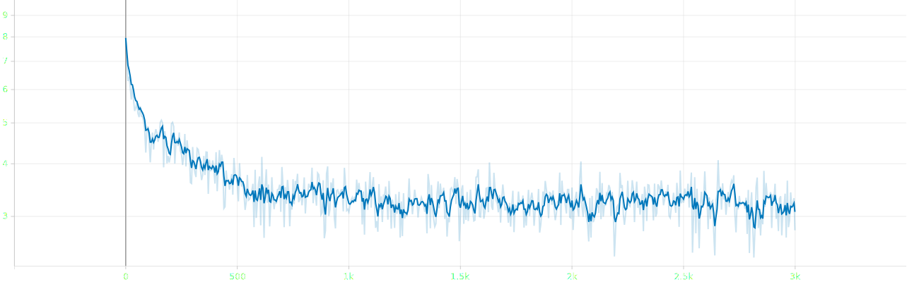
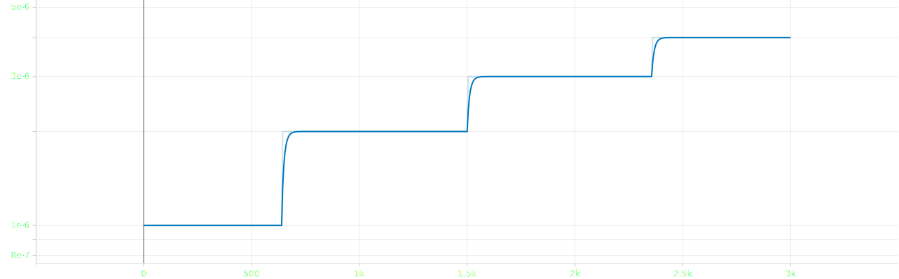
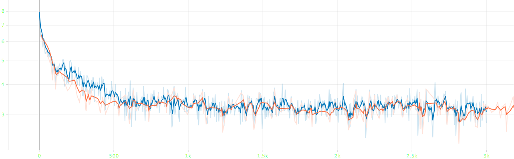

# attempt 6

## experimental settings
- randomly split `salmonn_stage1_data.json` into train, validation and test set with 90:5:5 ratio
- use smaller speech model `whisper-large-v2` &rarr; `whisper-medium`
- use smaller llm `vicuna-13b-v1.1` &rarr; `vicuna-7b-v1.1`
- ~~load llm in 8bit for low resource~~
- use torchrun for distributed learning
- reduced batch size `8` &rarr; `6` ~~and doubled gradient accumulation `1` &rarr; `2`~~, ~~not~~ keeping the ratio
- **scaled `warmup_start_lr`, `init_lr` and `min_lr` by 0.75x and scaled `init_lr` by 0.5x**
- **scaled `warmup_steps` by 3x**

## log

### train | 1st epoch | completed
```bash
Train: data epoch: [0]  [2999/3000]  eta: 0:00:00  lr: 0.000004  loss: 2.7810  time: 0.3620  data: 0.0000  max mem: 24757
Train: data epoch: [0] Total time: 0:18:07 (0.3624 s / it)
/home/jpong/miniconda3/envs/salmonn/lib/python3.9/site-packages/torch/distributed/distributed_c10d.py:4807: UserWarning: No device id is provided via `init_process_group` or `barrier `. Using the current device set by the user.
  warnings.warn(  # warn only once
2025-09-21 16:48:14,982 [INFO] Averaged stats: lr: 0.0000  loss: 3.4647
```

## result


- loss until epoch 1


- lr until epoch 1


- stop learning since <span style="color: rgb(0, 119, 187);">6th result</span> is worse than <span style="color: rgb(255, 112, 67);">5th one</span>

### first epoch
#### train | 1st epoch | completed
```json
{"train_lr": "0.000", "train_loss": "3.465"}
```