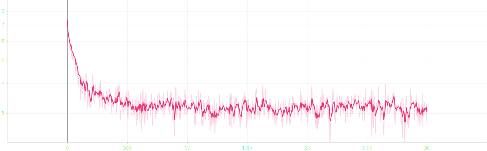
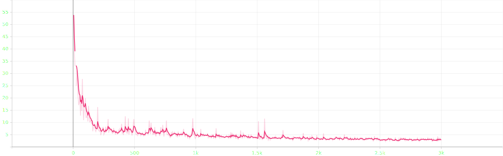
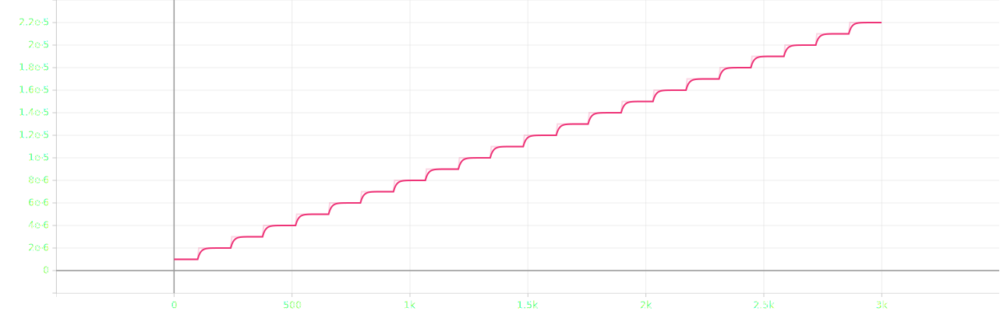
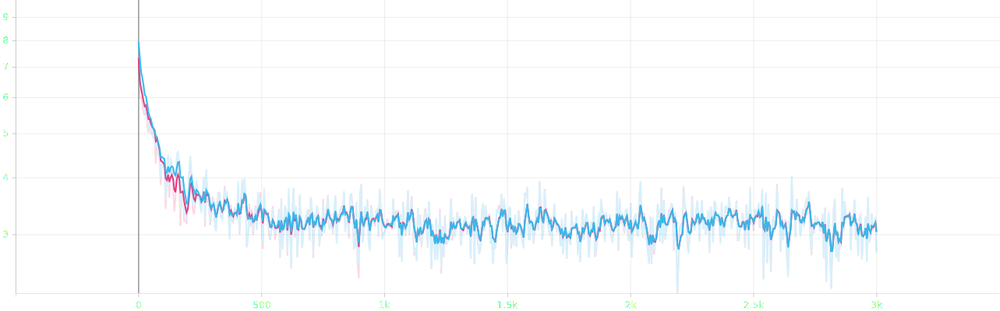

# attempt 9

- bug: avg grad_norm is inf
- current change: rollback speech encoder to `whisper-large-v2`
- planned change: gradient clipping `10` &rarr; `5`

## experimental settings
- randomly split `salmonn_stage1_data.json` into train, validation and test set with 90:5:5 ratio
- ~~use smaller speech model `whisper-large-v2` &rarr; `whisper-medium`~~
- use smaller llm `vicuna-13b-v1.1` &rarr; `vicuna-7b-v1.1`
- ~~load llm in 8bit for low resource~~
- use torchrun for distributed learning
- reduced batch size `8` &rarr; `6` ~~and doubled gradient accumulation `1` &rarr; `2`~~, ~~not~~ keeping the ratio
- scaled `warmup_start_lr`, `init_lr` and `min_lr` by 0.75x ~~and scaled `init_lr` by 0.5x~~
- ~~scaled `warmup_steps` by 3x~~
- ~~applied gradient clipping `1`~~
- scaled gradient clipping `1` &rarr; `10`

## log

### train | 1st epoch | completed
```bash
Train: data epoch: [0]  [2999/3000]  eta: 0:00:00  lr: 0.000022  loss: 2.7757  grad_norm: 2.7445  time: 0.4598  data: 0.0000  max mem: 26101
Train: data epoch: [0] Total time: 0:22:59 (0.4599 s / it)
/home/jpong/miniconda3/envs/salmonn/lib/python3.9/site-packages/torch/distributed/distributed_c10d.py:4807: UserWarning: No device id is provided via `init_process_group` or `barrier `. Using the current device set by the user.
  warnings.warn(  # warn only once
2025-09-21 21:49:13,373 [INFO] Averaged stats: lr: 0.0000  loss: 3.2922  grad_norm: in
```

## result


- loss until epoch 1


- grad norm until epoch 1


- lr until epoch 1


- compared to attempt 8 and 9, which differ only in speech encoder, it seems that size of speech encoder may not affect the results

### first epoch
#### train | 1st epoch | completed
```json
{"train_lr": "0.000", "train_loss": "3.292", "train_grad_norm": "inf"}
```